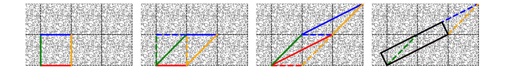

# Cuboid Remap

This is a python package which implements an algorithm to remap cubical domains with periodic boundary conditons (PBCs) to cuboid domains. 

 


## Description

The original implementation of this alogrithm by Jordan Carlson and Martin White is available [here](http://mwhite.berkeley.edu/BoxRemap/) and presented in [arxiv:1003.3178](https://arxiv.org/abs/1003.3178).  If you use this code, you should cite that original publication.


## Requirements

In order to use the functions in this package, you will need the following Python packages installed:

* [numpy](http://www.numpy.org)


## Installation

Place this directory in your PYTHONPATH.  The various functions can then be imported as, e.g.:

```
from cuboid_remap import remap
```

You can run the testing suite for this package using the [pytest](https://docs.pytest.org/en/latest/) framework by executing the following command in the package directory:

```
pytest
```


contact:
duncanc@andrew.cmu.edu
       
